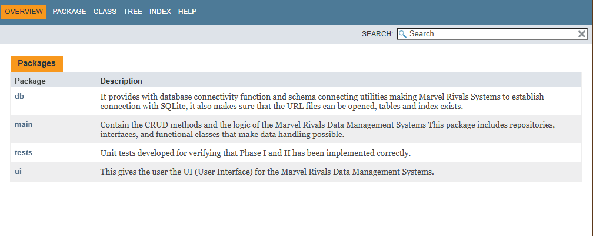

# COP-3330C-Module-11-Marvel-Rivals-DMS-
Upload the progress on Marvel Rivals DMS with the addition of the JavaDoc || Includes the zip file of the output javadoc and the code 

**Name:** Kenji Nakanishi 
**Course:** CEN 3024C Software Development-I 
**CRN:** 14877

**Description of the project: **

Marvel Rivals is a shooting game that is becoming very popular among PC & PS5 | PS4 gamers. I also enjoy this game so much that I wanted to create a DMS based on this game!
(Currenlty as 2025 November, Marvel Rivals has 343,000 players, and when peak time went up to 650,000. 

For Module 11, we will upload the JavaDoc required documentation to make easier on the software developers to create versioning or understand better the code structure.

We have the file called:

**Output Javadoc**

It contains all the code | artifacts | JavaDocs | Java files of the project

**Module11.zip**

**Tools used:**
- Java language
- IDE: JetBrain IntelliJ IDE
- JavaDoc 
